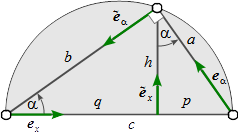

## The Right Triangle
---

Let the right triangle hypothenuse be aligned with the coordinate system *x-axis*. 
The vector loop closure equation then reads

$$a{\bold e}_\alpha - b\tilde{\bold e}_\alpha - c{\bold e}_x = \bold 0$$ 

with 

$${\bold e}_\alpha = \begin{pmatrix}\cos\alpha\\ \sin\alpha\end{pmatrix} $$ 

Resolving for the hypothenuse part $c{\bold e}_x$ in the loop closure equation 

$$ c{\bold e}_x = a{\bold e}_\alpha - b\tilde{\bold e}_\alpha$$

and squaring finally results in the Pythagorean theorem

$$c^2 = a^2 + b^2 $$ 

Introducing the hypothenuse segments $p={\bold a}\cdot{\bold e}_x$ and  $q={\bold b}\cdot{\bold e}_x$ we can further obtain the following useful formulas.

| segment *p* | segment *q* | height *h* | area |
|:---:|:---:|:---:|:---:|
|$cp = a^2$|$cq = b^2$|$pq = h^2$|$ab = ch$|
|
